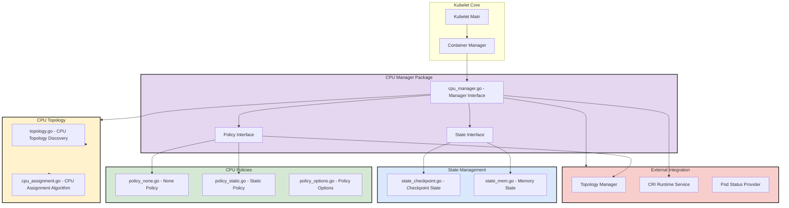
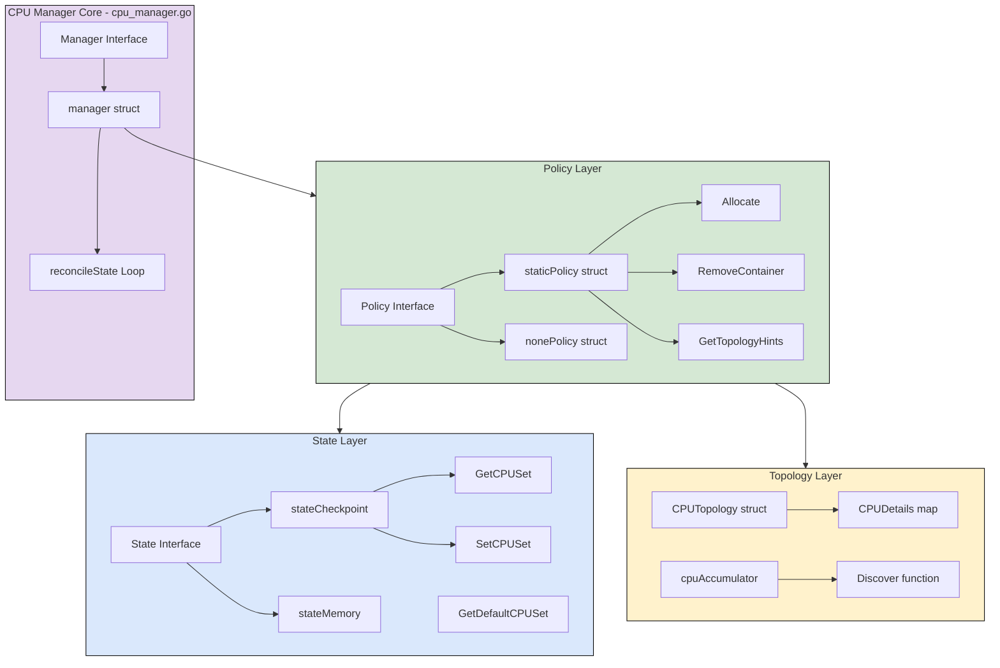
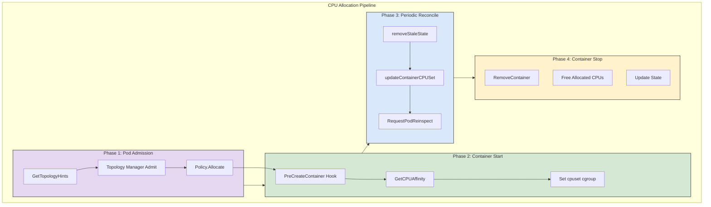
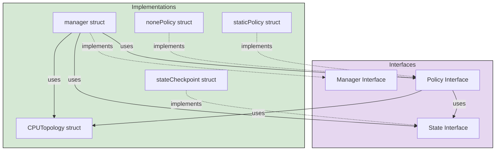
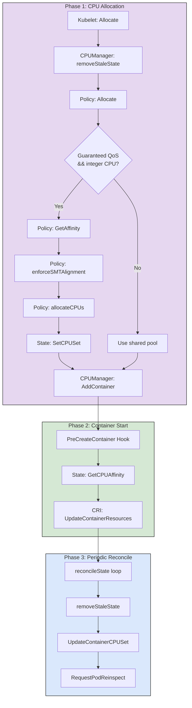
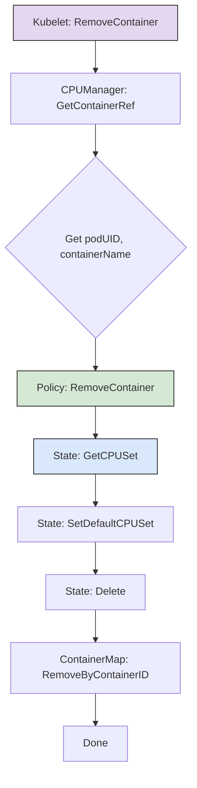
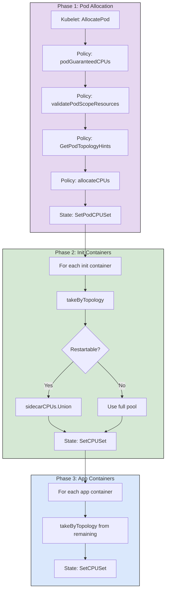
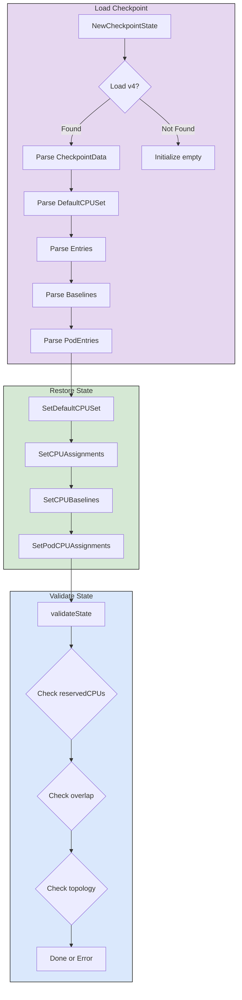
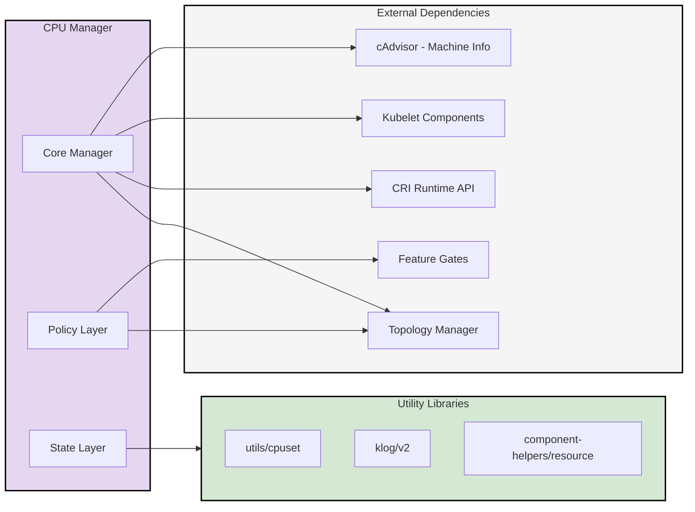

# Kubelet CPU Manager Architecture Design Document

**Version**: 1.0.0  
**Date**: 2026-08-13  
**Scope**: pkg/kubelet/cm/cpumanager  
**Generated by**: kubernetes-coding-analysis skill 1.0.0

---

## Processing Time Report

| Step | Duration |
|------|----------|
| Source Code Analysis | ~5 min |
| Architecture Extraction | ~2 min |
| Document Generation | ~3 min |
| **Total** | ~10 min |

---

## 1. Overview

### 1.1 Module Positioning

Kubelet CPU Manager 是 Kubernetes 节点资源管理的核心组件，负责在容器和 Pod 级别进行 CPU 资源的分配和管理。它通过可插拔的策略机制，支持从简单的共享池分配到复杂的独占 CPU 绑定等多种场景，确保容器化工作负载能够获得适当的 CPU 资源隔离和性能保障。

CPU Manager 位于 Kubelet 的 Container Manager 模块中，与 Memory Manager、Topology Manager 协同工作，共同实现节点级别的资源优化配置。

### 1.2 Core Functions

- **CPU 分配策略管理**:
  - **None Policy**: 默认策略，不进行 CPU 绑定，所有容器共享系统 CPU 池
  - **Static Policy**: 为 Guaranteed QoS 且 CPU 请求为整数的容器分配独占 CPU

- **Topology 感知分配**: 与 Topology Manager 集成，实现 NUMA 感知的 CPU 分配

- **状态持久化**: 通过 Checkpoint 机制保存 CPU 分配状态，支持 Kubelet 重启后恢复

- **动态资源调整**: 支持 In-Place Pod Vertical Scaling 特性，允许容器 CPU 资源的动态调整

---

## 2. Module Architecture

### 2.1 Overall Architecture Diagram



### 2.2 Detailed Internal Module Structure



### 2.3 Pipeline Internal Module Detail



### 2.4 Type Diagram



### 2.5 Module Responsibilities

| Module | File | Responsibility |
|--------|------|----------------|
| CPU Manager Core | pkg/kubelet/cm/cpumanager/cpu_manager.go | Manager 接口实现，协调策略、状态和拓扑管理 |
| Policy Interface | pkg/kubelet/cm/cpumanager/policy.go | 定义 CPU 分配策略接口 |
| Static Policy | pkg/kubelet/cm/cpumanager/policy_static.go | 静态策略实现，为 Guaranteed 容器分配独占 CPU |
| None Policy | pkg/kubelet/cm/cpumanager/policy_none.go | 默认策略，不进行 CPU 绑定 |
| Policy Options | pkg/kubelet/cm/cpumanager/policy_options.go | 策略选项配置 (FullPhysicalCPUsOnly, ScaleDelayTime 等) |
| State Checkpoint | pkg/kubelet/cm/cpumanager/state/state_checkpoint.go | Checkpoint 状态管理，支持持久化和恢复 |
| State Memory | pkg/kubelet/cm/cpumanager/state/state_mem.go | 内存状态实现 |
| CPU Topology | pkg/kubelet/cm/cpumanager/topology/topology.go | CPU 拓扑发现和查询 |
| CPU Assignment | pkg/kubelet/cm/cpumanager/cpu_assignment.go | CPU 分配算法 (NUMA 感知、SMT 对齐) |

---

## 3. Data Flow Design

### 3.1 CPU Allocation Flow (Static Policy)



### 3.2 Container Removal Flow



### 3.3 Pod-Level Resource Allocation Flow



### 3.4 Checkpoint State Restore Flow



---

## 4. Interface Design

### 4.1 Manager Interface (pkg/kubelet/cm/cpumanager/cpu_manager.go)

```go
// Manager interface provides methods for Kubelet to manage pod cpus.
type Manager interface {
    // Start is called during Kubelet initialization.
    Start(ctx context.Context, activePods ActivePodsFunc, sourcesReady config.SourcesReady, 
          podStatusProvider status.PodStatusProvider, containerRuntime runtimeService, 
          runtimeHelper kubecontainer.RuntimeHelper, initialContainers containermap.ContainerMap) error

    // Allocate triggers the allocation of CPUs to a container.
    Allocate(ctx context.Context, pod *v1.Pod, container *v1.Container, operation lifecycle.Operation) error

    // AddContainer adds the mapping between container ID to pod UID and container name.
    AddContainer(logger klog.Logger, p *v1.Pod, c *v1.Container, containerID string)

    // RemoveContainer is called after Kubelet decides to kill or delete a container.
    RemoveContainer(logger klog.Logger, containerID string) error

    // State returns a read-only interface to the internal CPU manager state.
    State() state.Reader

    // GetTopologyHints implements the topologymanager.HintProvider Interface.
    GetTopologyHints(logger klog.Logger, pod *v1.Pod, container *v1.Container, 
                     operation lifecycle.Operation) map[string][]topologymanager.TopologyHint

    // GetExclusiveCPUs returns exclusively allocated cpus for the container.
    GetExclusiveCPUs(podUID, containerName string) cpuset.CPUSet

    // GetCPUAffinity returns cpuset which includes cpus from shared pools
    // as well as exclusively allocated cpus.
    GetCPUAffinity(podUID, containerName string) cpuset.CPUSet

    // GetAllCPUs returns all the CPUs known by cpumanager.
    GetAllCPUs() cpuset.CPUSet
    
    // GetResourceIsolationLevel returns the isolation level of the container.
    GetResourceIsolationLevel(pod *v1.Pod, container *v1.Container) cmqos.ResourceIsolationLevel
}
```

### 4.2 Policy Interface (pkg/kubelet/cm/cpumanager/policy.go)

```go
// Policy implements logic for pod container to CPU assignment.
type Policy interface {
    Name() string
    Start(logger klog.Logger, s state.State) error
    
    // Allocate call is idempotent
    Allocate(logger klog.Logger, s state.State, pod *v1.Pod, container *v1.Container, 
             operation lifecycle.Operation) error
    
    // RemoveContainer call is idempotent
    RemoveContainer(logger klog.Logger, s state.State, podUID string, containerName string) error
    
    // GetTopologyHints implements the topologymanager.HintProvider Interface
    GetTopologyHints(logger klog.Logger, s state.State, pod *v1.Pod, container *v1.Container, 
                     operation lifecycle.Operation) map[string][]topologymanager.TopologyHint
    
    // GetPodTopologyHints implements the topologymanager.HintProvider Interface
    GetPodTopologyHints(logger klog.Logger, s state.State, pod *v1.Pod, 
                        operation lifecycle.Operation) map[string][]topologymanager.TopologyHint
    
    // AllocatePod is called to trigger the allocation of CPUs to a pod.
    AllocatePod(logger klog.Logger, s state.State, pod *v1.Pod, 
                operation lifecycle.Operation) error
    
    // GetAllocatableCPUs returns the total set of CPUs available for allocation.
    GetAllocatableCPUs(m state.State) cpuset.CPUSet
    
    // Releases CPUs that have been pending for scale-down after the timer expires.
    ReleaseTimedOutScaleDownCPUs(logger klog.Logger, s state.State)
    
    // Returns true if the ScaleDelayTime configured and the specified pod 
    // and container still during the ScaleDelayTime.
    IsDuringScaleDownDelay(podID, containerName string) bool
    
    // Returns the current allocated CPU for the specified pod and container.
    GetAssignments(s state.State, podUID, containerName string) string
}
```

### 4.3 State Interface (pkg/kubelet/cm/cpumanager/state/state.go)

```go
// State interface provides methods for tracking and updating CPU assignments.
type State interface {
    // Reader interface for read-only access
    Reader
    
    // SetCPUSet sets CPU set for a container
    SetCPUSet(podUID string, containerName string, cset cpuset.CPUSet)
    
    // SetDefaultCPUSet sets default CPU set (shared pool)
    SetDefaultCPUSet(cset cpuset.CPUSet)
    
    // SetCPUAssignments sets CPU to pod assignments
    SetCPUAssignments(a ContainerCPUAssignments)
    
    // Delete deletes assignment for specified pod and container
    Delete(podUID string, containerName string)
    
    // ClearState clears the state and saves it in a checkpoint
    ClearState()
}

// Reader interface for read-only state access
type Reader interface {
    GetCPUSet(podUID string, containerName string) (cpuset.CPUSet, bool)
    GetDefaultCPUSet() cpuset.CPUSet
    GetCPUSetOrDefault(podUID string, containerName string) cpuset.CPUSet
    GetCPUAssignments() ContainerCPUAssignments
    GetPodCPUAssignments() PodCPUAssignments
    GetPodCPUSet(podUID string) (cpuset.CPUSet, bool)
    GetBaselineCPUSet(podUID string, containerName string) (cpuset.CPUSet, bool)
    GetCPUBaselines() ContainerCPUBaselines
}
```

---

## 5. Data Structures

### 5.1 Core Types

| Type | Package | Purpose |
|------|---------|---------|
| `Manager` | pkg/kubelet/cm/cpumanager | CPU Manager 主接口 |
| `manager` | pkg/kubelet/cm/cpumanager | Manager 接口实现 |
| `Policy` | pkg/kubelet/cm/cpumanager | CPU 分配策略接口 |
| `staticPolicy` | pkg/kubelet/cm/cpumanager | 静态策略实现 |
| `nonePolicy` | pkg/kubelet/cm/cpumanager | 默认策略实现 |
| `State` | pkg/kubelet/cm/cpumanager/state | 状态管理接口 |
| `stateCheckpoint` | pkg/kubelet/cm/cpumanager/state | Checkpoint 状态实现 |
| `CPUTopology` | pkg/kubelet/cm/cpumanager/topology | CPU 拓扑信息 |
| `CPUDetails` | pkg/kubelet/cm/cpumanager/topology | CPU 详细信息映射 |
| `cpuAccumulator` | pkg/kubelet/cm/cpumanager | CPU 分配累加器 |

### 5.2 Static Policy CPU Sets

Static Policy 维护以下 CPU 集合：

| CPU Set | Description |
|---------|-------------|
| **SHARED** | Burstable、BestEffort 和非整数 Guaranteed 容器运行的 CPU 池。初始包含系统所有 CPU，随着独占分配创建和销毁而收缩和扩展 |
| **RESERVED** | 不可独占分配的共享池子集。大小为 `ceil(systemreserved.cpu + kubereserved.cpu)`。从最低编号的物理核心开始拓扑分配 |
| **ASSIGNABLE** | 等于 `SHARED - RESERVED`。独占 CPU 从此池分配 |
| **EXCLUSIVE ALLOCATIONS** | 独占分配给单个容器的 CPU 集合。存储在状态的显式分配中 |

### 5.3 Checkpoint State Format (V4)

```go
// CPUManagerCheckpointV4 is the v4 checkpoint structure
type CPUManagerCheckpointV4 struct {
    CheckpointData struct {
        PolicyName     string
        DefaultCPUSet  string
        Entries        map[string]map[string]string  // podUID -> containerName -> CPUSet
        Baselines      map[string]map[string]ContainerCPUs  // podUID -> containerName -> Baseline CPUSet
        PodEntries     PodCPUAssignments  // pod-level CPU assignments
    }
    DataChecksum uint64
}
```

---

## 6. Dependencies

### 6.1 External Dependencies



### 6.2 Dependency Description

| Dependency Module | Purpose |
|------------------|---------|
| Topology Manager | 提供 NUMA 感知的资源分配提示 |
| CRI Runtime API | 更新容器 CPU 资源 (cpuset.cpus) |
| cAdvisor | 发现节点 CPU 拓扑信息 |
| utils/cpuset | CPU 集合操作库 |
| component-helpers/resource | 资源计算辅助函数 |
| Feature Gates | 控制 InPlacePodVerticalScaling 等特性 |

---

## 7. Directory Structure

```
pkg/kubelet/cm/cpumanager/
├── OWNERS                          # Owner 配置
├── cpu_manager.go                  # Manager 接口和实现
├── cpu_manager_test.go             # Manager 单元测试
├── cpu_manager_others.go           # 非 Linux 平台实现
├── cpu_manager_windows.go          # Windows 平台实现
├── fake_cpu_manager.go             # Fake Manager 用于测试
│
├── policy.go                       # Policy 接口定义
├── policy_test.go                  # Policy 接口测试
├── policy_none.go                  # None Policy 实现
├── policy_none_test.go             # None Policy 测试
├── policy_static.go                # Static Policy 实现
├── policy_static_test.go           # Static Policy 测试
├── policy_static_restore_test.go   # Static Policy 恢复测试
├── policy_options.go               # Policy 选项配置
├── policy_options_test.go          # Policy 选项测试
│
├── cpu_assignment.go               # CPU 分配算法
├── cpu_assignment_test.go          # CPU 分配测试
│
├── topology/
│   ├── topology.go                 # CPU 拓扑发现和查询
│   ├── topology_test.go            # 拓扑测试
│   └── hints.go                    # Topology Hints 生成
│
└── state/
    ├── state.go                    # State 接口定义
    ├── state_checkpoint.go         # Checkpoint State 实现
    ├── state_mem.go                # Memory State 实现
    └── state_test.go               # State 测试
```

---

## 8. Key Algorithms

### 8.1 CPU Allocation Algorithm (takeByTopology)

CPU 分配算法遵循 NUMA 感知原则，按内存层次结构从粗到细分配：

1. **确定内存层次结构**: 比较 NUMA Node 和 Socket 的 CPU 数量，确定哪个在层次结构中更高
2. **取整层**: 优先分配完整的 NUMA Node 或 Socket
3. **取次层**: 在已选层内分配完整的次级单元
4. **取核心**: 在已选单元内分配完整的物理核心
5. **取 CPU**: 最后分配单个逻辑 CPU

```
层次结构示例 (NUMA > Socket):
Level 1: NUMA Nodes (按空闲 CPU 排序)
  Level 2: Sockets within NUMA (按空闲 CPU 排序)
    Level 3: Cores within Socket (按空闲 CPU 排序)
      Level 4: CPUs within Core (按 ID 排序)
```

### 8.2 SMT Alignment Enforcement

当启用 `FullPhysicalCPUsOnly` 选项时：

1. **检查请求对齐**: 请求的 CPU 数必须是每核心线程数的倍数
2. **检查物理 CPU 可用性**: 确保有足够的完整物理核心可用
3. **错误处理**: 如果不满足对齐要求，返回 `SMTAlignmentError`

### 8.3 Init Container CPU Reuse

对于非重启型 Init 容器：

1. **分配独占 CPU**: Init 容器运行前分配独占 CPU
2. **标记可复用**: Init 容器完成后，其 CPU 标记为可被同 Pod 后续容器复用
3. **Sidecar 特殊处理**: 重启型 Init 容器 (Sidecar) 的 CPU 不标记为可复用

### 8.4 Scale-Down Delay Timer

当配置 `ScaleDelayTime` 选项时：

1. **缩容时启动计时器**: 容器 CPU 请求减少时，不立即释放 CPU
2. **延迟释放**: 等待配置的延迟时间后，才将 CPU 返回共享池
3. **防止抖动**: 避免频繁的扩缩容导致 CPU 分配抖动

---

## 9. Design Decisions

### 9.1 Decision: Policy-Based Architecture

**Decision**: 使用可插拔策略模式实现 CPU 管理

**Rationale**:
- 支持不同的 CPU 管理需求 (共享 vs 独占)
- 易于扩展新策略
- 策略间隔离，互不影响
- 用户可根据工作负载特性选择合适策略

### 9.2 Decision: Checkpoint-Based State Persistence

**Decision**: 使用 Checkpoint 文件持久化 CPU 分配状态

**Rationale**:
- Kubelet 重启后恢复 CPU 分配
- 保持独占 CPU 容器的性能隔离
- 避免重启后 CPU 重新分配导致的性能抖动
- 支持状态验证和一致性检查

### 9.3 Decision: NUMA-Aware Allocation

**Decision**: CPU 分配考虑 NUMA 拓扑，优先分配同一 NUMA 节点的 CPU

**Rationale**:
- 减少跨 NUMA 节点的内存访问延迟
- 与 Topology Manager 集成实现多资源 NUMA 对齐
- 提升内存密集型工作负载性能

### 9.4 Decision: Static Policy Requires Reserved CPU

**Decision**: Static Policy 要求 `systemreserved.cpu + kubereserved.cpu > 0`

**Rationale**:
- 防止共享池被完全耗尽
- 确保 BestEffort/Burstable 容器有 CPU 可用
- 避免违反独占性保证或需要驱逐零 CPU 容器

---

## 10. Quality Attributes

### 10.1 Performance Requirements

| Metric | Target |
|--------|--------|
| CPU 分配延迟 | < 100ms |
| Reconcile 周期 | 默认 10 秒，可配置 |
| Checkpoint 写入 | 异步，不阻塞容器操作 |
| Topology Hint 生成 | < 50ms |

### 10.2 Constraints

| Constraint | Status |
|------------|--------|
| Static Policy 需要预留 CPU | ✅ 强制执行 |
| 独占容器必须 Guaranteed QoS | ✅ 强制执行 |
| 独占容器 CPU 请求必须为整数 | ✅ 强制执行 |
| Checkpoint 文件权限 0644 | ✅ 强制执行 |

### 10.3 Reliability

| Aspect | Implementation |
|--------|----------------|
| 状态持久化 | Checkpoint 文件 + 校验和 |
| 状态验证 | 启动时验证一致性 |
| 错误恢复 | 状态不一致时需清空节点并删除 Checkpoint |
| 并发安全 | 所有公开方法使用互斥锁保护 |

---

## 11. Extension Points

### 11.1 Adding New CPU Policy

要添加新的 CPU 分配策略：

1. 实现 `Policy` 接口
2. 在 `NewManager()` 中注册新策略
3. 添加策略选项 (如需要)
4. 编写单元测试和集成测试
5. 更新文档和用户指南

### 11.2 Adding New Policy Options

要添加新的策略选项：

1. 在 `policy_options.go` 中定义选项结构
2. 添加选项解析和验证逻辑
3. 在策略实现中使用选项
4. 更新命令行标志和配置 API

### 11.3 Modifying CPU Allocation Algorithm

要修改 CPU 分配算法：

1. 修改 `cpu_assignment.go` 中的 `cpuAccumulator` 逻辑
2. 确保 NUMA 感知逻辑正确
3. 更新相关测试用例
4. 验证性能影响

---

## 12. References

- [Kubernetes CPU Manager Documentation](https://kubernetes.io/docs/tasks/administer-cluster/cpu-management-policies/)
- [CPU Manager KEP](https://github.com/kubernetes/enhancements/tree/master/keps/sig-node/606-cpu-manager)
- [Topology Manager KEP](https://github.com/kubernetes/enhancements/tree/master/keps/sig-node/693-topology-manager)
- [In-Place Pod Vertical Scaling KEP](https://github.com/kubernetes/enhancements/tree/master/keps/sig-node/1287-in-place-update-pod-resources)
- [cAdvisor CPU Topology](https://github.com/google/cadvisor/blob/master/info/v1/machine.go)

---

## Verification Checklist

- [x] **CPU Manager Core**
  - [x] Manager interface identified (pkg/kubelet/cm/cpumanager/cpu_manager.go:60-119)
  - [x] Manager implementation identified (pkg/kubelet/cm/cpumanager/cpu_manager.go:121-171)
  - [x] Reconcile loop identified (pkg/kubelet/cm/cpumanager/cpu_manager.go:460-552)

- [x] **CPU Policies**
  - [x] Policy interface identified (pkg/kubelet/cm/cpumanager/policy.go:29-53)
  - [x] None Policy identified (pkg/kubelet/cm/cpumanager/policy_none.go:30-93)
  - [x] Static Policy identified (pkg/kubelet/cm/cpumanager/policy_static.go:203-1932)
  - [x] Policy options identified (pkg/kubelet/cm/cpumanager/policy_options.go)

- [x] **State Management**
  - [x] State interface identified (pkg/kubelet/cm/cpumanager/state/state.go)
  - [x] Checkpoint State identified (pkg/kubelet/cm/cpumanager/state/state_checkpoint.go:37-468)
  - [x] Checkpoint format V4 identified

- [x] **CPU Topology**
  - [x] CPUTopology struct identified (pkg/kubelet/cm/cpumanager/topology/topology.go:40-47)
  - [x] Discover function identified (pkg/kubelet/cm/cpumanager/topology/topology.go:353-388)
  - [x] CPU assignment algorithm identified (pkg/kubelet/cm/cpumanager/cpu_assignment.go)

- [x] **Integration Points**
  - [x] Topology Manager integration verified
  - [x] CRI Runtime integration verified
  - [x] PreCreateContainer hook integration verified

---

**Document generation complete.**
