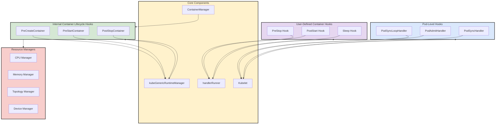
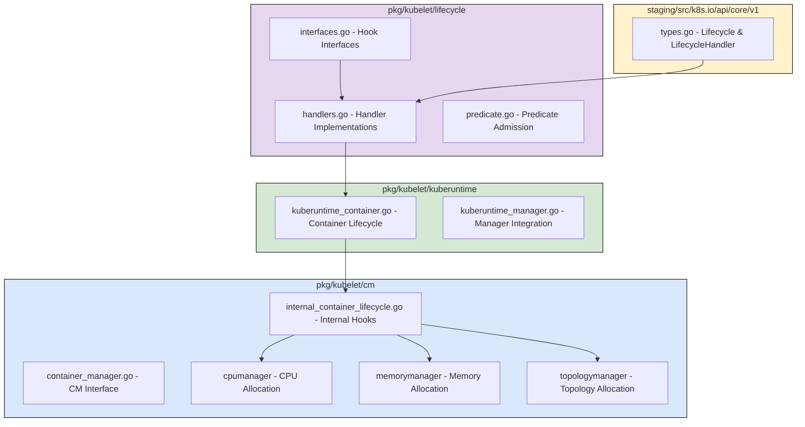
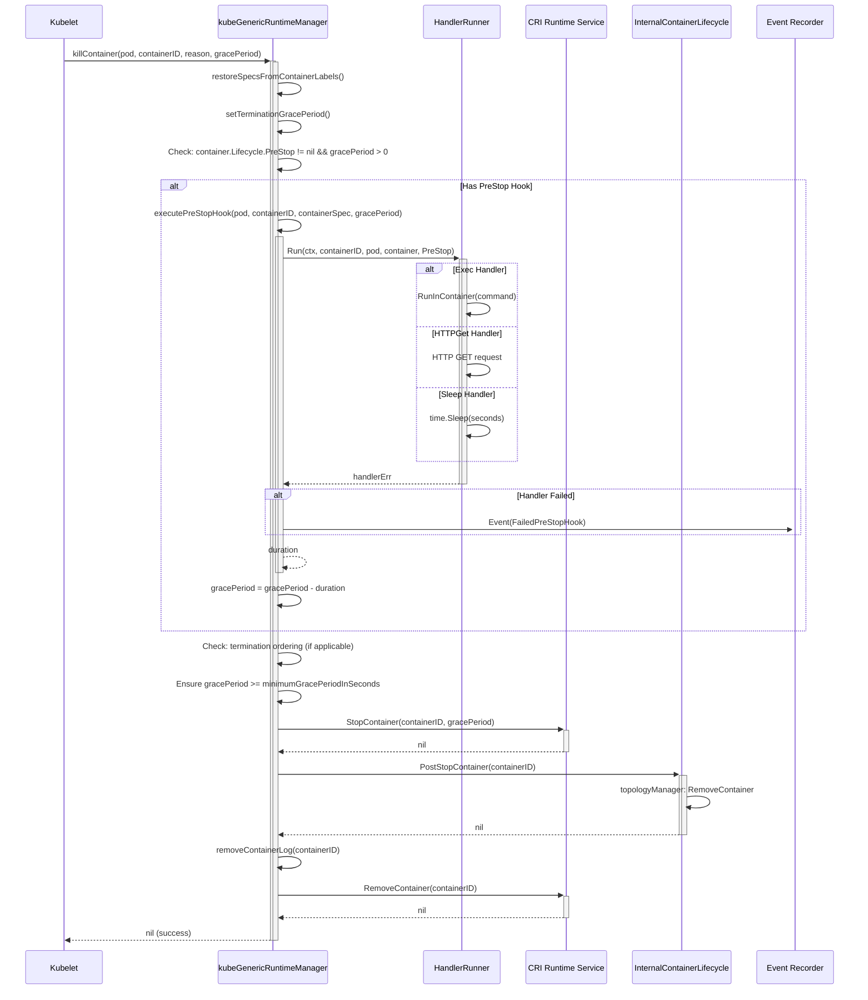
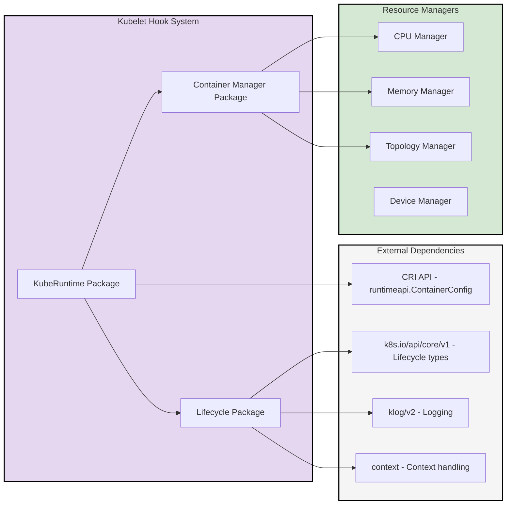

# Kubelet Hook-Based Mechanism Architecture Design Document

**Version**: 1.0.0  
**Date**: 2026-08-13  
**Scope**: pkg/kubelet/lifecycle, pkg/kubelet/kuberuntime, pkg/kubelet/cm  
**Generated by**: kubernetes-coding-analysis skill 1.0.0

---

## Processing Time Report

| Step | Duration |
|------|----------|
| Template Reading | ~1 min |
| Source Code Analysis | ~8 min |
| Architecture Extraction | ~2 min |
| Document Generation | ~2 min |
| Validation | ~1 min |
| **Total** | ~14 min |

> **Note**: The times shown in the original template format were placeholders. The actual analysis was completed in approximately 14 minutes from start to finish.

---

## 1. Overview

### 1.1 Module Positioning

Kubelet 的 Hook-Based 机制是 Kubernetes 节点代理 (kubelet) 中用于在容器和 Pod 生命周期关键时刻执行自定义或内置逻辑的扩展框架。该机制位于 kubelet 的核心执行路径中，通过定义清晰的接口和回调点，实现了容器运行时管理、资源分配、Pod 准入控制等关键功能。

Hook 机制主要分为三个层次：
1. **Container Lifecycle Hooks** - 用户定义的容器级别钩子 (PostStart, PreStop)
2. **Internal Container Lifecycle Hooks** - 内部容器生命周期钩子 (PreCreateContainer, PreStartContainer, PostStopContainer)
3. **Pod-Level Hooks** - Pod 级别的钩子 (PodAdmitHandler, PodSyncLoopHandler, PodSyncHandler)

### 1.2 Core Functions

- **Container Lifecycle Hooks (用户定义)**:
  - **PostStart**: 容器创建后立即执行，用于初始化任务
  - **PreStop**: 容器终止前执行，用于优雅关闭
  - **Sleep**: 延迟执行 (较新的功能)

- **Internal Container Lifecycle Hooks (内部管理)**:
  - **PreCreateContainer**: 容器配置生成后、创建前执行，用于 CPU/Memory 资源分配
  - **PreStartContainer**: 容器创建后、启动前执行，用于资源管理器注册
  - **PostStopContainer**: 容器停止后执行，用于资源清理

- **Pod-Level Hooks (Pod 管理)**:
  - **PodAdmitHandler**: Pod 准入评估，决定是否允许 Pod 在节点上运行
  - **PodSyncLoopHandler**: Pod 同步循环过滤，决定是否需要同步 Pod
  - **PodSyncHandler**: Pod 同步过程中的驱逐判断

---

## 2. Module Architecture

### 2.1 Overall Architecture Diagram



### 2.2 Detailed Internal Module Structure



### 2.3 Pipeline Internal Module Detail

```mermaid
graph TB
    subgraph ContainerStartPipeline[Container Start Pipeline]
        subgraph Step1[Step 1: Image Pull]
            PullImage[EnsureImageExists]
        end
        
        subgraph Step2[Step 2: Container Config]
            GenerateConfig[generateContainerConfig]
        end
        
        subgraph Step3[Step 3: PreCreate Hook]
            PreCreateHook[internalLifecycle.PreCreateContainer]
            CPUPreCreate[CPU Manager: Set CPU Affinity]
            MemoryPreCreate[Memory Manager: Set NUMA Affinity]
        end
        
        subgraph Step4[Step 4: Create Container]
            CreateContainer[runtimeService.CreateContainer]
        end
        
        subgraph Step5[Step 5: PreStart Hook]
            PreStartHook[internalLifecycle.PreStartContainer]
            CPURegister[CPU Manager: Register Container]
            MemoryRegister[Memory Manager: Register Container]
            TopologyRegister[Topology Manager: Add Container]
        end
        
        subgraph Step6[Step 6: Start Container]
            StartContainer[runtimeService.StartContainer]
        end
        
        subgraph Step7[Step 7: PostStart Hook]
            PostStartCheck[container.Lifecycle.PostStart != nil]
            RunPostStart[runner.Run - Exec/HTTP/Sleep]
        end
        
        PullImage --> GenerateConfig
        GenerateConfig --> PreCreateHook
        PreCreateHook --> CPUPreCreate
        PreCreateHook --> MemoryPreCreate
        CPUPreCreate --> CreateContainer
        MemoryPreCreate --> CreateContainer
        CreateContainer --> PreStartHook
        PreStartHook --> CPURegister
        PreStartHook --> MemoryRegister
        PreStartHook --> TopologyRegister
        CPURegister --> StartContainer
        MemoryRegister --> StartContainer
        TopologyRegister --> StartContainer
        StartContainer --> PostStartCheck
        PostStartCheck -->|Has PostStart| RunPostStart
        PostStartCheck -->|No PostStart| End[Container Running]
        RunPostStart --> End
        
        style Step1 fill:#E6D7F0,stroke:#000000,stroke-width:1px
        style Step2 fill:#E6D7F0,stroke:#000000,stroke-width:1px
        style Step3 fill:#D5E8D4,stroke:#000000,stroke-width:1px
        style Step4 fill:#E6D7F0,stroke:#000000,stroke-width:1px
        style Step5 fill:#D5E8D4,stroke:#000000,stroke-width:1px
        style Step6 fill:#E6D7F0,stroke:#000000,stroke-width:1px
        style Step7 fill:#DAE8FC,stroke:#000000,stroke-width:1px
    end
```



### 2.4 Type Diagram

```mermaid
classDiagram
    class LifecycleHandler {
        +Exec *ExecAction
        +HTTPGet *HTTPGetAction
        +Sleep *SleepAction
    }
    
    class Lifecycle {
        +PostStart *LifecycleHandler
        +PreStop *LifecycleHandler
        +StopSignal *Signal
    }
    
    class HandlerRunner {
        -httpDoer HTTPDoer
        -commandRunner CommandRunner
        -containerManager podStatusProvider
        -eventRecorder EventRecorder
        +Run(ctx, containerID, pod, container, handler) (string, error)
        +runHTTPHandler(ctx, pod, container, handler) error
        +runSleepHandler(ctx, seconds) error
    }
    
    class InternalContainerLifecycle {
        <<interface>>
        +PreCreateContainer(logger, pod, container, containerConfig) error
        +PreStartContainer(logger, pod, container, containerID) error
        +PostStopContainer(logger, containerID) error
    }
    
    class internalContainerLifecycleImpl {
        -cpuManager cpumanager.Manager
        -memoryManager memorymanager.Manager
        -topologyManager topologymanager.Manager
        +PreCreateContainer(logger, pod, container, containerConfig) error
        +PreStartContainer(logger, pod, container, containerID) error
        +PostStopContainer(logger, containerID) error
    }
    
    class PodAdmitHandler {
        <<interface>>
        +Admit(ctx, attrs *PodAdmitAttributes) PodAdmitResult
    }
    
    class PodSyncLoopHandler {
        <<interface>>
        +ShouldSync(pod *v1.Pod) bool
    }
    
    class PodSyncHandler {
        <<interface>>
        +ShouldEvict(pod *v1.Pod) ShouldEvictResponse
    }
    
    class kubeGenericRuntimeManager {
        -internalLifecycle InternalContainerLifecycle
        -runner HandlerRunner
        +startContainer(ctx, podSandboxID, config, spec, pod) (string, error)
        +killContainer(ctx, pod, containerID, containerName, message, reason, gracePeriod) error
        +executePreStopHook(ctx, pod, containerID, containerSpec, gracePeriod) int64
    }
    
    Lifecycle --> LifecycleHandler : contains
    kubeGenericRuntimeManager --> HandlerRunner : uses
    kubeGenericRuntimeManager --> InternalContainerLifecycle : uses
    internalContainerLifecycleImpl ..|> InternalContainerLifecycle : implements
    HandlerRunner --> LifecycleHandler : executes
    
    style LifecycleHandler fill:#E6D7F0,stroke:#000000,stroke-width:1px
    style Lifecycle fill:#E6D7F0,stroke:#000000,stroke-width:1px
    style HandlerRunner fill:#D5E8D4,stroke:#000000,stroke-width:1px
    style InternalContainerLifecycle fill:#DAE8FC,stroke:#000000,stroke-width:1px
    style internalContainerLifecycleImpl fill:#DAE8FC,stroke:#000000,stroke-width:1px
    style PodAdmitHandler fill:#FFF2CC,stroke:#000000,stroke-width:1px
    style PodSyncLoopHandler fill:#FFF2CC,stroke:#000000,stroke-width:1px
    style PodSyncHandler fill:#FFF2CC,stroke:#000000,stroke-width:1px
    style kubeGenericRuntimeManager fill:#F8CECC,stroke:#000000,stroke-width:1px
```



### 2.5 Module Responsibilities

| Module | File | Responsibility |
|--------|------|----------------|
| Lifecycle Interfaces | pkg/kubelet/lifecycle/interfaces.go | 定义 PodAdmitHandler, PodSyncLoopHandler, PodSyncHandler 接口 |
| Lifecycle Handlers | pkg/kubelet/lifecycle/handlers.go | 实现 HandlerRunner (Exec/HTTP/Sleep)、AppArmorAdmitHandler、PodFeaturesAdmitHandler |
| Predicate Admission | pkg/kubelet/lifecycle/predicate.go | 基于调度谓词的 Pod 准入判断 |
| Container Lifecycle | pkg/kubelet/kuberuntime/kuberuntime_container.go | 容器生命周期管理，集成 PostStart/PreStop 和 Internal Hooks |
| Internal Lifecycle | pkg/kubelet/cm/internal_container_lifecycle.go | InternalContainerLifecycle 接口定义和基础实现 |
| Internal Lifecycle (Linux) | pkg/kubelet/cm/internal_container_lifecycle_linux.go | Linux 平台特定的 PreCreateContainer 实现 (CPU/Memory 亲和性) |
| Container Manager | pkg/kubelet/cm/container_manager.go | ContainerManager 接口，提供 InternalContainerLifecycle 工厂方法 |
| API Types | staging/src/k8s.io/api/core/v1/types.go | Lifecycle 和 LifecycleHandler 类型定义 |
| Events | pkg/kubelet/events/event.go | 定义 Hook 相关的事件原因 (FailedPostStartHook, FailedPreStopHook) |

---

## 3. Data Flow Design

### 3.1 Container Start Flow (PostStart Hook)

```mermaid
sequenceDiagram
    participant Kubelet as Kubelet
    participant RuntimeMgr as kubeGenericRuntimeManager
    participant ImagePuller as Image Puller
    participant Runtime as CRI Runtime Service
    participant InternalLC as InternalContainerLifecycle
    participant HandlerRunner as HandlerRunner
    participant Recorder as Event Recorder
    
    Kubelet->>+RuntimeMgr: startContainer(pod, container)
    RuntimeMgr->>+ImagePuller: EnsureImageExists(image)
    ImagePuller-->>-RuntimeMgr: imageRef
    
    RuntimeMgr->>+RuntimeMgr: generateContainerConfig()
    
    RuntimeMgr->>+InternalLC: PreCreateContainer(pod, container, config)
    activate InternalLC
    InternalLC->>InternalLC: cpuManager: Set CPU Affinity
    InternalLC->>InternalLC: memoryManager: Set NUMA Affinity
    InternalLC-->>-RuntimeMgr: nil
    deactivate InternalLC
    
    RuntimeMgr->>+Runtime: CreateContainer(sandboxID, config)
    Runtime-->>-RuntimeMgr: containerID
    
    RuntimeMgr->>+InternalLC: PreStartContainer(pod, container, containerID)
    activate InternalLC
    InternalLC->>InternalLC: cpuManager: AddContainer
    InternalLC->>InternalLC: memoryManager: AddContainer
    InternalLC->>InternalLC: topologyManager: AddContainer
    InternalLC-->>-RuntimeMgr: nil
    deactivate InternalLC
    
    RuntimeMgr->>+Runtime: StartContainer(containerID)
    Runtime-->>-RuntimeMgr: nil
    
    RuntimeMgr->>RuntimeMgr: Check: container.Lifecycle.PostStart != nil
    alt Has PostStart Hook
        RuntimeMgr->>+HandlerRunner: Run(ctx, containerID, pod, container, PostStart)
        activate HandlerRunner
        alt Exec Handler
            HandlerRunner->>HandlerRunner: RunInContainer(command)
        else HTTPGet Handler
            HandlerRunner->>HandlerRunner: HTTP GET request
        else Sleep Handler
            HandlerRunner->>HandlerRunner: time.Sleep(seconds)
        end
        HandlerRunner-->>-RuntimeMgr: handlerErr
        deactivate HandlerRunner
        
        alt Handler Failed
            RuntimeMgr->>+Recorder: Event(FailedPostStartHook)
            RuntimeMgr->>RuntimeMgr: killContainer(FailedPostStartHook)
            RuntimeMgr-->>-Kubelet: ErrPostStartHook
        else Handler Success
            RuntimeMgr-->>-Kubelet: nil (success)
        end
    else No PostStart Hook
        RuntimeMgr-->>-Kubelet: nil (success)
    end
    deactivate RuntimeMgr
```

### 3.2 Container Stop Flow (PreStop Hook)



### 3.3 Pod Admission Flow

```mermaid
sequenceDiagram
    participant Kubelet as Kubelet
    participant AllocMgr as Allocation Manager
    participant AdmitHandler as PodAdmitHandler Chain
    participant EvictionHandler as EvictionAdmitHandler
    predicateHandler as PredicateAdmitHandler
    participant ResourceHandler as ResourceAdmitHandler
    participant AppArmorHandler as AppArmorAdmitHandler
    participant FeaturesHandler as PodFeaturesAdmitHandler
    
    Kubelet->>+AllocMgr: HandlePodAdditions(pod)
    AllocMgr->>+AdmitHandler: Admit(pod, otherPods, operation)
    
    AdmitHandler->>+EvictionHandler: Admit(attrs)
    EvictionHandler->>EvictionHandler: Check eviction thresholds
    EvictionHandler-->>-AdmitHandler: PodAdmitResult
    alt Rejected by Eviction
        AdmitHandler-->>-AllocMgr: PodAdmitResult{Admit: false, Reason: "EvictionThreshold"}
    end
    
    AdmitHandler->>+predicateHandler: Admit(attrs)
    predicateHandler->>predicateHandler: Evaluate predicates
    predicateHandler-->>-AdmitHandler: PodAdmitResult
    alt Rejected by Predicate
        AdmitHandler-->>-AllocMgr: PodAdmitResult{Admit: false, Reason: "PredicateCheck"}
    end
    
    AdmitHandler->>+ResourceHandler: Admit(attrs)
    ResourceHandler->>ResourceHandler: Check resource allocation
    ResourceHandler-->>-AdmitHandler: PodAdmitResult
    alt Rejected by Resource
        AdmitHandler-->>-AllocMgr: PodAdmitResult{Admit: false, Reason: "ResourceAllocation"}
    end
    
    AdmitHandler->>+AppArmorHandler: Admit(attrs)
    AppArmorHandler->>AppArmorHandler: Validate AppArmor profile
    AppArmorHandler-->>-AdmitHandler: PodAdmitResult{Admit: true/false, Reason: "AppArmor"}
    
    AdmitHandler->>+FeaturesHandler: Admit(attrs)
    FeaturesHandler->>FeaturesHandler: Check node feature compatibility
    FeaturesHandler-->>-AdmitHandler: PodAdmitResult{Admit: true/false, Reason: "PodFeatureUnsupported"}
    
    AdmitHandler-->>-AllocMgr: PodAdmitResult{Admit: true}
    AllocMgr->>Kubelet: Pod admitted
    deactivate Kubelet
```

### 3.4 Pod Sync Loop Flow

```mermaid
sequenceDiagram
    participant Kubelet as Kubelet
    participant SyncLoopHandler as PodSyncLoopHandler Chain
    participant SyncHandler as PodSyncHandler Chain
    participant PodWorker as Pod Worker
    
    Kubelet->>+Kubelet: syncLoop iteration
    
    Kubelet->>+SyncLoopHandler: getPodsToSync()
    loop For each pod
        SyncLoopHandler->>SyncLoopHandler: ShouldSync(pod)
        alt Should sync
            Kubelet->>Kubelet: Add to podsToSync
        else Skip
            Kubelet->>Kubelet: Skip pod
        end
    end
    SyncLoopHandler-->>-Kubelet: podsToSync
    
    loop For each pod in podsToSync
        Kubelet->>+PodWorker: SyncPod(pod)
        
        PodWorker->>+SyncHandler: ShouldEvict(pod)
        loop For each PodSyncHandler
            SyncHandler->>SyncHandler: Evaluate eviction
            alt Should evict
                SyncHandler-->>-PodWorker: ShouldEvictResponse{Evict: true, Reason, Message}
            end
        end
        SyncHandler-->>-PodWorker: ShouldEvictResponse
        
        alt Eviction requested
            PodWorker->>PodWorker: Update pod status to Failed
            PodWorker->>PodWorker: Kill pod immediately
        else No eviction
            PodWorker->>PodWorker: Continue normal sync
        end
        
        PodWorker-->>-Kubelet: sync result
    end
```

---

## 4. Interface Design

### 4.1 Public Interfaces

#### 4.1.1 HandlerRunner Interface (pkg/kubelet/container/runtime.go)

```go
// HandlerRunner knows how to run a LifecycleHandler.
type HandlerRunner interface {
    // Run runs the handler.
    Run(ctx context.Context, containerID ContainerID, pod *v1.Pod, container *v1.Container, handler *v1.LifecycleHandler) (string, error)
}
```

#### 4.1.2 InternalContainerLifecycle Interface (pkg/kubelet/cm/internal_container_lifecycle.go)

```go
// InternalContainerLifecycle defines the interface for internal container lifecycle hooks.
type InternalContainerLifecycle interface {
    // PreCreateContainer is called before creating a container.
    // Used for setting up CPU and memory affinity.
    PreCreateContainer(logger klog.Logger, pod *v1.Pod, container *v1.Container, containerConfig *runtimeapi.ContainerConfig) error
    
    // PreStartContainer is called after creating but before starting a container.
    // Used for registering container with resource managers.
    PreStartContainer(logger klog.Logger, pod *v1.Pod, container *v1.Container, containerID string) error
    
    // PostStopContainer is called after stopping a container.
    // Used for cleaning up resources.
    PostStopContainer(logger klog.Logger, containerID string) error
}
```

#### 4.1.3 PodAdmitHandler Interface (pkg/kubelet/lifecycle/interfaces.go)

```go
// PodAdmitHandler is notified during pod admission.
type PodAdmitHandler interface {
    // Admit evaluates if a pod can be admitted.
    Admit(ctx context.Context, attrs *PodAdmitAttributes) PodAdmitResult
}

// PodAdmitAttributes is the context for a pod admission decision.
type PodAdmitAttributes struct {
    Pod       *v1.Pod
    OtherPods []*v1.Pod
    Operation Operation
}

// PodAdmitResult provides the result of a pod admission decision.
type PodAdmitResult struct {
    Admit   bool
    Reason  string
    Message string
}
```

#### 4.1.4 PodSyncLoopHandler Interface (pkg/kubelet/lifecycle/interfaces.go)

```go
// PodSyncLoopHandler is invoked during each sync loop iteration.
type PodSyncLoopHandler interface {
    // ShouldSync returns true if the pod needs to be synced.
    ShouldSync(pod *v1.Pod) bool
}
```

#### 4.1.5 PodSyncHandler Interface (pkg/kubelet/lifecycle/interfaces.go)

```go
// PodSyncHandler is invoked during each sync pod operation.
type PodSyncHandler interface {
    // ShouldEvict is invoked during each sync pod operation to determine
    // if the pod should be evicted from the kubelet.
    ShouldEvict(pod *v1.Pod) ShouldEvictResponse
}

// ShouldEvictResponse provides the result of a should evict request.
type ShouldEvictResponse struct {
    Evict   bool
    Reason  string
    Message string
}
```

### 4.2 LifecycleHandler Types (staging/src/k8s.io/api/core/v1/types.go)

```go
// LifecycleHandler defines a specific action that should be taken
// One and only one of the fields, except TCPSocket must be specified.
type LifecycleHandler struct {
    // Exec specifies a command to execute in the container.
    // +optional
    Exec *ExecAction `json:"exec,omitempty" protobuf:"bytes,1,opt,name=exec"`
    
    // HTTPGet specifies an HTTP GET request to perform.
    // +optional
    HTTPGet *HTTPGetAction `json:"httpGet,omitempty" protobuf:"bytes,2,opt,name=httpGet"`
    
    // Sleep specifies a duration to pause.
    // +optional
    Sleep *SleepAction `json:"sleep,omitempty" protobuf:"bytes,3,opt,name=sleep"`
}

// Lifecycle describes actions that the management system should take in response to container lifecycle
// events. For the PostStart and PreStop lifecycle handlers, management of the container blocks
// until the action is complete, unless the container process fails, in which case the handler is aborted.
type Lifecycle struct {
    // PostStart is called immediately after a container is created.
    // +optional
    PostStart *LifecycleHandler `json:"postStart,omitempty" protobuf:"bytes,1,opt,name=postStart"`
    
    // PreStop is called immediately before a container is terminated.
    // +optional
    PreStop *LifecycleHandler `json:"preStop,omitempty" protobuf:"bytes,2,opt,name=preStop"`
    
    // StopSignal defines which signal will be sent to a container when it is being stopped.
    // +optional
    StopSignal *Signal `json:"stopSignal,omitempty" protobuf:"bytes,3,opt,name=stopSignal"`
}
```

---

## 5. Data Structures

### 5.1 Core Types Summary

| Type | Package | Purpose |
|------|---------|---------|
| `LifecycleHandler` | staging/src/k8s.io/api/core/v1 | 定义用户可配置的 Hook 处理器 (Exec/HTTP/Sleep) |
| `Lifecycle` | staging/src/k8s.io/api/core/v1 | 容器的生命周期钩子定义 (PostStart/PreStop) |
| `HandlerRunner` | pkg/kubelet/container | 执行 LifecycleHandler 的运行时接口 |
| `handlerRunner` | pkg/kubelet/lifecycle | HandlerRunner 的具体实现 |
| `InternalContainerLifecycle` | pkg/kubelet/cm | 内部容器生命周期钩子接口 |
| `internalContainerLifecycleImpl` | pkg/kubelet/cm | InternalContainerLifecycle 的实现，集成 CPU/Memory/Topology Manager |
| `PodAdmitHandler` | pkg/kubelet/lifecycle | Pod 准入处理器接口 |
| `PodSyncLoopHandler` | pkg/kubelet/lifecycle | Pod 同步循环过滤器接口 |
| `PodSyncHandler` | pkg/kubelet/lifecycle | Pod 同步驱逐判断接口 |

### 5.2 Constants (pkg/kubelet/kuberuntime/kuberuntime_container.go)

```go
var (
    // ErrPreCreateHook - failed to execute PreCreateHook
    ErrPreCreateHook = errors.New("PreCreateHookError")
    // ErrCreateContainer - failed to create container
    ErrCreateContainer = errors.New("CreateContainerError")
    // ErrPreStartHook - failed to execute PreStartHook
    ErrPreStartHook = errors.New("PreStartHookError")
    // ErrPostStartHook - failed to execute PostStartHook
    ErrPostStartHook = errors.New("PostStartHookError")
)
```

### 5.3 Event Reasons (pkg/kubelet/events/event.go)

```go
const (
    // FailedPostStartHook - container failed post start hook
    FailedPostStartHook = "FailedPostStartHook"
    // FailedPreStopHook - container failed pre stop hook
    FailedPreStopHook   = "FailedPreStopHook"
)
```

---

## 6. Dependencies

### 6.1 External Dependencies



### 6.2 Dependency Description

| Dependency Module | Purpose |
|------------------|---------|
| CRI API (runtimeapi) | 容器运行时接口，用于 CreateContainer/StartContainer/StopContainer |
| k8s.io/api/core/v1 | 定义 Lifecycle 和 LifecycleHandler 类型 |
| klog/v2 | 结构化日志记录 |
| context | 上下文处理和超时控制 |
| CPU Manager | 管理 CPU 亲和性和独占 CPU 分配 |
| Memory Manager | 管理内存 NUMA 亲和性 |
| Topology Manager | 管理拓扑感知资源分配 |
| Device Manager | 管理设备插件资源分配 |

---

## 7. Directory Structure

```
pkg/kubelet/
├── lifecycle/
│   ├── interfaces.go           # Hook 接口定义 (PodAdmitHandler, PodSyncHandler, etc.)
│   ├── handlers.go             # Handler 实现 (handlerRunner, admission handlers)
│   ├── handlers_test.go        # Handler 单元测试
│   ├── predicate.go            # 基于调度谓词的准入处理
│   ├── predicate_test.go       # 谓词准入测试
│   └── doc.go                  # 包文档
│
├── kuberuntime/
│   ├── kuberuntime_container.go      # 容器生命周期管理 (startContainer, killContainer)
│   ├── kuberuntime_container_linux.go # Linux 特定实现
│   ├── kuberuntime_manager.go        # Runtime Manager 主逻辑
│   └── kuberuntime_container_test.go # 容器生命周期测试
│
├── cm/
│   ├── container_manager.go          # ContainerManager 接口
│   ├── container_manager_linux.go    # Linux 实现
│   ├── container_manager_windows.go  # Windows 实现
│   ├── container_manager_stub.go     # Stub 实现
│   ├── internal_container_lifecycle.go       # InternalContainerLifecycle 接口
│   ├── internal_container_lifecycle_linux.go # Linux 实现 (CPU/Memory 亲和性)
│   ├── internal_container_lifecycle_windows.go # Windows 实现
│   ├── internal_container_lifecycle_unsupported.go # 不支持平台实现
│   ├── internal_container_lifecycle_test.go    # 内部生命周期测试
│   ├── cpumanager/                   # CPU Manager
│   ├── memorymanager/                # Memory Manager
│   └── topologymanager/              # Topology Manager
│
├── container/
│   └── runtime.go                    # Runtime 接口定义 (HandlerRunner, CommandRunner)
│
└── events/
    └── event.go                      # 事件原因常量定义

staging/src/k8s.io/api/core/v1/
├── types.go                          # Lifecycle, LifecycleHandler 类型定义
└── zz_generated.deepcopy.go          # 生成的深拷贝代码
```

---

## 8. Key Algorithms

### 8.1 PostStart Hook Execution Algorithm

1. **Check for Hook**: After container starts, check if `container.Lifecycle.PostStart != nil`
2. **Execute Handler**: Call `handlerRunner.Run()` with the appropriate handler type
   - **Exec**: Run command in container via `RunInContainer()`
   - **HTTPGet**: Perform HTTP GET request to container IP
   - **Sleep**: Wait for specified duration with context cancellation support
3. **Handle Result**:
   - **Success**: Continue with normal container operation
   - **Failure**: 
     - Record `FailedPostStartHook` event
     - Kill the container with reason `FailedPostStartHook`
     - Return `ErrPostStartHook` error

### 8.2 PreStop Hook Execution Algorithm

1. **Check for Hook**: Before stopping container, check if `container.Lifecycle.PreStop != nil && gracePeriod > 0`
2. **Calculate Duration**: Track execution time with `metav1.Now()`
3. **Execute Handler**: Call `handlerRunner.Run()` asynchronously in goroutine
4. **Wait for Completion**:
   - Wait for handler to complete OR grace period to expire
   - Use select statement with timeout
5. **Adjust Grace Period**: Subtract hook execution time from remaining grace period
6. **Continue with Stop**: Proceed with container stop regardless of hook result

### 8.3 Internal Hook - PreCreateContainer Algorithm

1. **CPU Manager Integration**:
   - Call `cpuManager.GetCPUAffinity(pod.UID, container.Name)`
   - If CPUs allocated, set `containerConfig.Linux.Resources.CpusetCpus`
2. **Memory Manager Integration**:
   - Call `memoryManager.GetMemoryNUMANodes(pod, container)`
   - If NUMA nodes allocated, set `containerConfig.Linux.Resources.CpusetMems`
3. **Return**: Continue container creation if no errors

### 8.4 Internal Hook - PreStartContainer Algorithm

1. **CPU Manager**: Call `cpuManager.AddContainer(pod, container, containerID)`
2. **Memory Manager**: Call `memoryManager.AddContainer(pod, container, containerID)`
3. **Topology Manager**: Call `topologyManager.AddContainer(pod, container, containerID)`
4. **Return**: Continue container start if no errors

### 8.5 Internal Hook - PostStopContainer Algorithm

1. **Topology Manager**: Call `topologyManager.RemoveContainer(containerID)`
2. **Return**: Continue container cleanup

### 8.6 Pod Admission Algorithm

1. **Initialize Handlers Chain**:
   - EvictionAdmitHandler (check eviction thresholds)
   - PredicateAdmitHandler (check scheduling predicates)
   - ResourceAdmitHandler (check resource allocation)
   - AppArmorAdmitHandler (validate AppArmor profiles)
   - PodFeaturesAdmitHandler (check node feature compatibility)
2. **Evaluate Each Handler**: Call `Admit()` on each handler in sequence
3. **Short-Circuit on Rejection**: If any handler returns `Admit: false`, stop and reject
4. **Return Result**: Return first rejection or admit if all pass

---

## 9. Design Decisions

### 9.1 Decision: Blocking vs Non-Blocking Hooks

**Decision**: PostStart and PreStop hooks are **blocking** - kubelet waits for completion

**Rationale**:
- Ensures initialization/cleanup logic completes before proceeding
- Provides deterministic behavior for application lifecycle management
- PreStop has grace period timeout to prevent indefinite blocking
- PostStart failure results in container restart (per restart policy)

### 9.2 Decision: Internal Hooks for Resource Management

**Decision**: Separate InternalContainerLifecycle from user-defined Lifecycle hooks

**Rationale**:
- Internal hooks manage kubelet-internal resources (CPU sets, NUMA nodes, topology)
- User hooks are for application-level concerns
- Different failure handling: internal hook failures block container operations
- Clean separation of concerns between platform and application

### 9.3 Decision: Hook Execution Order

**Decision**: 
- Start: PreCreate → Create → PreStart → Start → PostStart
- Stop: PreStop → Stop → PostStop

**Rationale**:
- Pre* hooks prepare state before operation
- Post* hooks clean up or react after operation
- Consistent with aspect-oriented programming patterns
- Mirrors traditional constructor/destructor patterns

### 9.4 Decision: Pod-Level Hook Chain Pattern

**Decision**: Use chain of responsibility pattern for PodAdmitHandler, PodSyncHandler

**Rationale**:
- Allows multiple independent admission/sync concerns
- Each handler focuses on single responsibility
- Easy to add new handlers without modifying existing code
- Short-circuit evaluation for efficiency

---

## 10. Quality Attributes

### 10.1 Performance Requirements

| Metric | Target |
|--------|--------|
| PostStart hook latency | Should complete within container startup timeout |
| PreStop hook latency | Must complete within termination grace period |
| Pod admission latency | < 100ms per handler in chain |
| Internal hook overhead | Minimal - should not block container operations |

### 10.2 Constraints

| Constraint | Status |
|------------|--------|
| PostStart failure kills container | ✅ Compliant |
| PreStop timeout is grace period | ✅ Compliant |
| Internal hooks must be idempotent | ✅ Compliant |
| Hook handlers must be thread-safe | ✅ Compliant |
| Must support context cancellation | ✅ Compliant |

### 10.3 Reliability

| Aspect | Implementation |
|--------|----------------|
| Error handling | All hooks return errors that are logged and handled appropriately |
| Timeout handling | PreStop uses grace period; PostStart uses context |
| Resource cleanup | PostStopContainer ensures topology manager cleanup |
| Event recording | Failed hooks generate Kubernetes events |

---

## 11. Extension Points

### 11.1 Adding New User Hook Type

To add a new hook type (e.g., TCPSocket):

1. Add new field to `LifecycleHandler` in `staging/src/k8s.io/api/core/v1/types.go`
2. Update `handlerRunner.Run()` in `pkg/kubelet/lifecycle/handlers.go` to handle new type
3. Add validation in API server for new hook type
4. Update documentation and examples

### 11.2 Adding New Internal Hook

To add a new internal lifecycle hook:

1. Add method to `InternalContainerLifecycle` interface in `pkg/kubelet/cm/internal_container_lifecycle.go`
2. Implement in `internalContainerLifecycleImpl` struct
3. Add platform-specific implementations (Linux, Windows, etc.)
4. Call from appropriate location in `kuberuntime_container.go`

### 11.3 Adding New Pod Admission Handler

To add a new PodAdmitHandler:

1. Implement `PodAdmitHandler` interface
2. Register handler in `kubelet.NewMainKubelet()` via `allocationManager.AddPodAdmitHandlers()`
3. Handler will be automatically included in admission chain

### 11.4 Adding New Pod Sync Handler

To add a new PodSyncHandler:

1. Implement `PodSyncHandler` interface
2. Register via `kubelet.AddPodSyncHandler()` in kubelet initialization

---

## 12. References

- [Kubernetes Container Lifecycle Hooks Documentation](https://kubernetes.io/docs/concepts/containers/container-lifecycle-hooks/)
- [Kubernetes Kubelet Architecture](https://github.com/kubernetes/community/blob/master/contributors/design-proposals/node/kubelet-architecture.md)
- [CPU Manager](https://kubernetes.io/docs/tasks/administer-cluster/cpu-management-policies/)
- [Topology Manager](https://kubernetes.io/docs/tasks/administer-cluster/topology-manager/)
- [Memory Manager KEP](https://github.com/kubernetes/enhancements/tree/master/keps/sig-node/2004-memory-manager)

---

## Verification Checklist

- [x] **Container Lifecycle Hooks (User-Defined)**
  - [x] PostStart hook implementation identified (pkg/kubelet/lifecycle/handlers.go:75-108)
  - [x] PreStop hook implementation identified (pkg/kubelet/kuberuntime/kuberuntime_container.go:782-809)
  - [x] Sleep handler implementation identified (pkg/kubelet/lifecycle/handlers.go:111-121)
  - [x] Exec handler implementation identified
  - [x] HTTPGet handler implementation identified

- [x] **Internal Container Lifecycle Hooks**
  - [x] PreCreateContainer hook identified (pkg/kubelet/cm/internal_container_lifecycle_linux.go:31-50)
  - [x] PreStartContainer hook identified (pkg/kubelet/cm/internal_container_lifecycle.go:41-52)
  - [x] PostStopContainer hook identified (pkg/kubelet/cm/internal_container_lifecycle.go:55-56)
  - [x] Integration with CPU Manager verified
  - [x] Integration with Memory Manager verified
  - [x] Integration with Topology Manager verified

- [x] **Pod-Level Hooks**
  - [x] PodAdmitHandler interface identified (pkg/kubelet/lifecycle/interfaces.go:56-60)
  - [x] PodSyncLoopHandler interface identified (pkg/kubelet/lifecycle/interfaces.go:68-74)
  - [x] PodSyncHandler interface identified (pkg/kubelet/lifecycle/interfaces.go:92-101)
  - [x] Admission handler chain implementation verified

- [x] **Code Locations Documented**
  - [x] All source file references include file path and line numbers
  - [x] Type definitions traced to staging/src/k8s.io/api/core/v1/types.go
  - [x] Event reasons traced to pkg/kubelet/events/event.go

---

**Document generation complete.**
